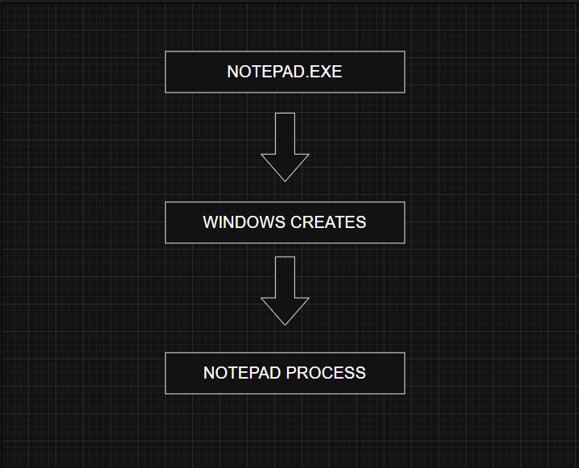
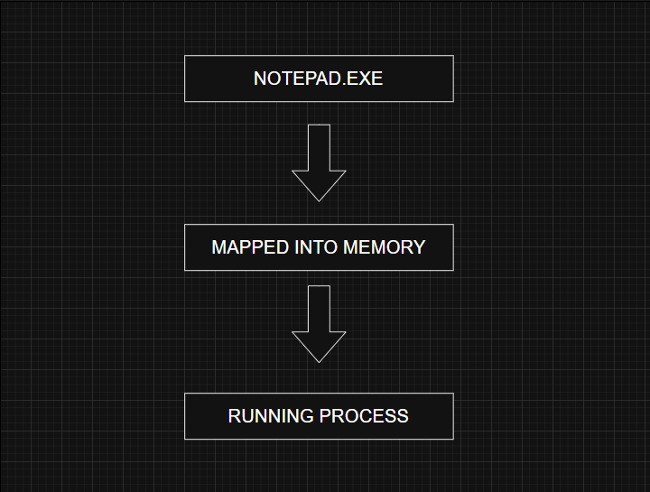
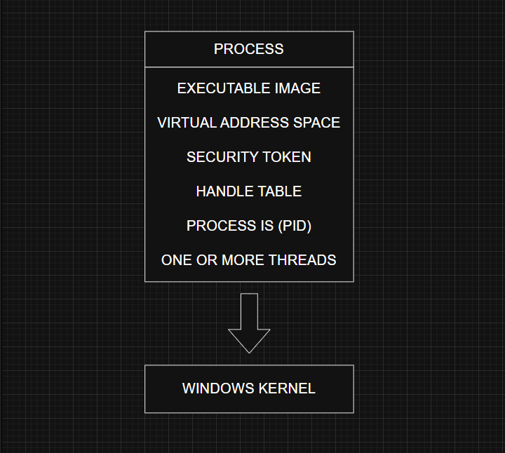
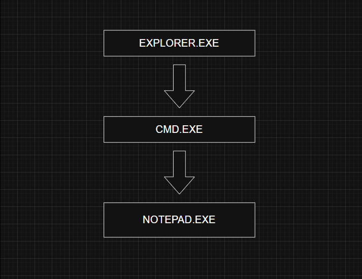

# Processes

> **Prerequisites**
> 
> - Windows API
>     
> - User Mode vs Kernel Mode
>     
> - Virtual Memory (Recommended)
>     

---

# What is a Process?

A **process** is an executing instance of a program. While a program is simply a file stored on disk containing executable instructions, a process is the runtime environment that Windows creates to execute those instructions.

Think of it this way:

- **Program** → A static executable stored on disk (for example, `notepad.exe`).
    
- **Process** → The running instance of that executable, along with the resources Windows allocates to it.
    

Every application you launch creates one or more processes.

---

# Program vs Process

|Program|Process|
|---|---|
|Stored on disk|Exists in memory while running|
|Static|Dynamic|
|Contains executable instructions|Contains instructions, memory, threads, handles, and security information|
|Passive|Active|

Example:

If you open Notepad three times, Windows creates **three separate processes**, each with its own memory and resources.

---

# Why does Windows use Processes?

Processes provide **isolation** between applications.

Without processes:

- One application could overwrite another application's memory.
    
- A crashing application could bring down the entire operating system.
    
- Applications would have unrestricted access to each other's data.
    

By creating a separate process for every running application, Windows ensures:

- Memory isolation
    
- Security
    
- Stability
    
- Resource management
    

---

# Components of a Windows Process

A Windows process is much more than executable code. It acts as a container for several resources required during execution.

## 1. Virtual Address Space

Each process receives its own private virtual address space.

This memory stores:

- Executable code
    
- Loaded DLLs
    
- Heap
    
- Stack
    
- Global variables
    

Two processes cannot directly access each other's virtual memory without special permissions.

---

## 2. Executable Image

Every process starts from an executable image (EXE).

When a process is created, Windows maps the executable into the process's virtual address space.

Example:

---

## 3. Open Handles

A process maintains a table of handles that reference Windows objects.

Common examples include:

- Files
    
- Registry keys
    
- Events
    
- Mutexes
    
- Semaphores
    
- Processes
    
- Threads
    

A handle is not the object itself—it is simply a reference that Windows uses to identify and manage that resource.

---

## 4. Security Context

Every process runs under a security context represented by an **access token**.

The token contains information such as:

- User identity
    
- Group memberships
    
- Privileges
    
- Session information
    
- Integrity level
    
- AppContainer details (if applicable)
    

Windows uses this token to determine what actions the process is allowed to perform.

---

## 5. Process Identifier (PID)

Every process is assigned a unique **Process ID (PID)**.

Windows uses the PID to identify a running process.

Example:

explorer.exe
PID : 4280

notepad.exe
PID : 9524

Process IDs remain unique only while a process is running. After a process exits, its PID may later be reused.

---

## 6. Threads

A process must contain at least one thread to execute instructions.

A **thread** is the smallest unit of execution scheduled by the operating system.

A process can have:

- One thread
    
- Multiple threads
    
- Hundreds of threads
    

Without a thread, a process cannot perform any work.

---

# Process Architecture

---

# Process States

A process can exist in different states depending on the condition of its threads.

## Running

This is the normal operating state.

The process is active and at least one of its threads is eligible to execute.

Even while running, some threads may temporarily wait for:

- Disk I/O
    
- Network operations
    
- Synchronization objects
    
- User input
    

---

## Suspended

A process enters the suspended state when all of its threads are suspended.

In this state:

- No instructions execute.
    
- CPU usage becomes zero.
    
- The process remains in memory.
    

Windows may suspend background applications to conserve CPU time and battery life, especially on portable devices.

Developers can also suspend processes programmatically using native Windows APIs.

---

## Not Responding

A graphical application is marked **Not Responding** when its UI thread stops processing Windows messages for an extended period.

This does **not** necessarily mean the application has crashed.

Possible causes include:

- Heavy CPU usage
    
- Waiting for disk operations
    
- Network delays
    
- Deadlocks
    

While this happens, Windows greys out the application's window and appends **"(Not Responding)"** to its title.

---

# Parent and Child Processes

Most processes are created by another process.

Example:

Here:

- Explorer launches Command Prompt.
    
- Command Prompt launches Notepad.
    

Explorer is the parent of Command Prompt, and Command Prompt is the parent of Notepad.

---

## Parent vs Creator Process

The parent process is not always the process that directly called the process creation API.

Some applications use **broker** or **helper** processes to launch new applications on their behalf.

Windows may record the visible application as the parent instead of the helper process to provide a more meaningful process tree.

---

# Viewing Processes

Several tools allow you to inspect running processes.

Common examples include:

- Task Manager
    
- Process Explorer
    
- Process Hacker
    
- Process Monitor (for related activity)
    

Among these, **Process Explorer** provides significantly more detail, including process trees, loaded DLLs, handles, threads, memory usage, and security information.

---

# Windows Internals Relevance

Processes are one of the fundamental objects managed by the Windows kernel.

Understanding processes is essential before studying:

- Threads
    
- Virtual Memory
    
- Scheduling
    
- Handles
    
- Tokens
    
- Object Manager
    

Many Windows APIs ultimately operate on process objects.

---

# Red Team Perspective

Processes are involved in many offensive security techniques.

Examples include:

- Process Injection
    
- Process Hollowing
    
- Parent Process ID (PPID) Spoofing
    
- DLL Injection
    
- Token Theft
    
- Handle Duplication
    

Attackers often interact with processes using APIs such as:

- `OpenProcess()`
    
- `CreateProcess()`
    
- `VirtualAllocEx()`
    
- `WriteProcessMemory()`
    
- `CreateRemoteThread()`
    

Understanding how Windows manages processes is critical when learning malware development and Active Directory post-exploitation.

---

# Blue Team Perspective

Defenders monitor process activity to detect malicious behavior.

Common indicators include:

- Unusual parent-child relationships
    
- Suspicious command-line arguments
    
- Unexpected child processes
    
- Code injection attempts
    
- High-privilege processes spawning user applications
    

Tools such as Sysmon, Microsoft Defender for Endpoint, and EDR platforms rely heavily on process creation events for threat detection.

---

# Key Takeaways

- A process is a running instance of a program.
    
- Every process has its own virtual memory, security context, handle table, and one or more threads.
    
- Windows uses processes to provide isolation, security, and stability.
    
- Process states include Running, Suspended, and Not Responding.
    
- Parent and creator processes are not always the same.
    
- Understanding processes is fundamental to Windows Internals, malware analysis, and offensive security.
    

---

# References

- _Windows Internals, Part 1 (7th Edition)_ – Mark Russinovich, David Solomon, Alex Ionescu, Pavel Yosifovich
