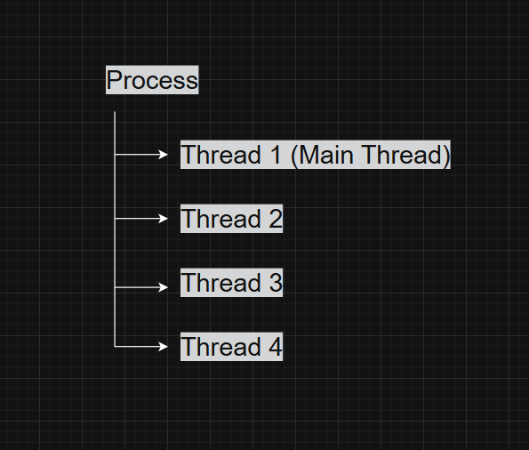
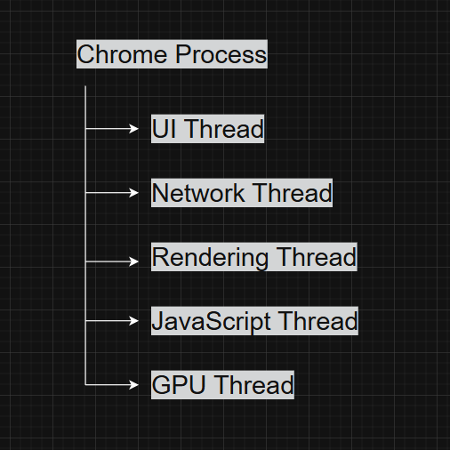
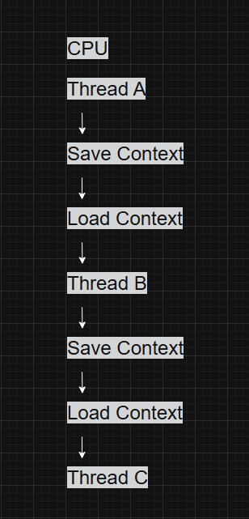
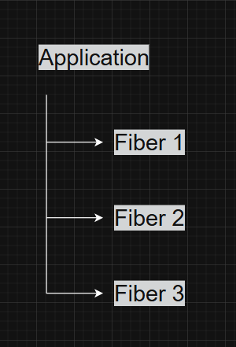
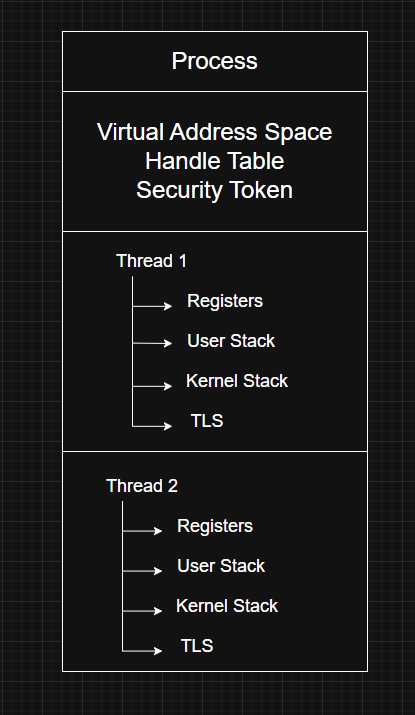

# Threads

---

# What is a Thread?

A **thread** is the smallest unit of execution managed by the Windows scheduler. Every process must contain at least one thread, because without a thread there is nothing to execute the program's instructions.

While a **process** acts as a container for resources such as memory, handles, and security information, a **thread** is responsible for actually running the code inside that process.

One process can contain multiple threads that execute independently while sharing the same process resources.

---

# Process vs Thread

| Process | Thread |
|----------|---------|
| Container for resources | Executes instructions |
| Has its own virtual address space | Shares the process address space |
| Has one or more threads | Belongs to exactly one process |
| Owns handles and security information | Owns execution context and stacks |

Example:

---

# Why do Threads Exist?

If Windows allowed only one thread per process, applications would perform only one task at a time.

For example, a web browser would freeze while downloading a file.

Instead, applications use multiple threads so different tasks can run simultaneously.

Example:

Each thread performs a specific task while sharing the same process resources.

---

# Components of a Thread

A thread contains several pieces of information that allow Windows to pause, resume, and schedule its execution.

## 1. CPU Register State

Every thread maintains its own CPU register values.

These registers store information such as:

- Instruction Pointer (RIP/EIP)
- Stack Pointer (RSP/ESP)
- General-purpose registers
- Flags register

Whenever Windows switches between threads, it saves the current register values and restores the registers of the next thread.

This saved information is known as the **thread context**.

---

## 2. User-Mode Stack

Every thread has its own user-mode stack.

The stack stores:

- Function parameters
- Local variables
- Return addresses
- Saved registers

Each thread requires a separate stack because multiple threads may execute different functions at the same time.

---

## 3. Kernel-Mode Stack

Whenever a thread enters kernel mode through a system call or an interrupt, Windows switches execution to a dedicated kernel stack.

This separation improves both security and reliability by keeping user-mode and kernel-mode execution isolated.

---

## 4. Thread Local Storage (TLS)

Although threads share the process memory, they sometimes require private storage.

Windows provides **Thread Local Storage (TLS)** for this purpose.

TLS allows every thread to maintain its own copy of data without interfering with other threads.

Common uses include:

- Runtime libraries
- DLL-specific data
- Per-thread variables

---

## 5. Thread Identifier (TID)

Every thread receives a unique **Thread ID (TID)**.

Like a Process ID (PID), a TID uniquely identifies a running thread while it exists.

Process IDs and Thread IDs are allocated from the same namespace, meaning Windows never assigns the same value to both a PID and a TID at the same time.

---

## 6. Security Context

By default, threads use the security token of their parent process.

However, a thread can temporarily obtain a different security token through **impersonation**.

This feature is commonly used by server applications that perform actions on behalf of connected clients.

---

# Thread Context

The complete execution state of a thread is called its **context**.

It includes:

- CPU registers
- User-mode stack
- Kernel-mode stack
- Thread Local Storage

Whenever Windows performs a **context switch**, it saves the context of the currently running thread and restores the context of another thread.

This mechanism allows multiple threads to share a single processor.

---

# Context Switching

The Windows scheduler rapidly switches between runnable threads.

This process is known as a **context switch**.

Although context switching creates the illusion that multiple threads are running simultaneously, it introduces overhead because the processor state must be saved and restored.

---

# WOW64 Threads

Windows supports running 32-bit applications on 64-bit operating systems through **WOW64 (Windows-on-Windows 64)**.

A thread belonging to a 32-bit application maintains both:

- A 32-bit execution context
- A 64-bit execution context

Windows switches between these contexts whenever execution transitions between 32-bit application code and the underlying 64-bit operating system.

---

# Fibers

Fibers are lightweight execution units managed entirely in user mode.

Unlike threads, fibers are **not scheduled by the Windows kernel**.

Instead, the application itself decides which fiber should execute.

A thread can be converted into a fiber using the Windows API, after which additional fibers can be created.

Unlike threads, fibers do not begin executing automatically. The application must explicitly switch between them.

### Advantages

- Lower switching overhead
- User-controlled scheduling

### Limitations

- No true parallel execution
- Cooperative scheduling only
- Difficult debugging
- Shared Thread Local Storage
- Poor performance for blocking operations

For most applications, standard Windows threads are the preferred choice.

---

# User-Mode Scheduling (UMS)

User-Mode Scheduling (UMS) is an advanced scheduling model available on 64-bit Windows.

UMS combines some of the efficiency of fibers with better integration into the Windows scheduler.

Unlike fibers:

- UMS threads remain visible to the kernel.
- Blocking system calls are supported.
- Multiple UMS threads can share kernel resources more efficiently.

When execution remains entirely in user mode, switching between UMS threads avoids expensive scheduler involvement.

When kernel services are required, Windows temporarily switches to a dedicated kernel thread.

---

# Shared Process Resources

All threads within the same process share several resources.

These include:

- Virtual address space
- Loaded DLLs
- Heap memory
- Handle table
- Security information (unless impersonating)

Because of this shared environment, communication between threads is extremely efficient.

However, synchronization mechanisms such as mutexes, events, semaphores, and critical sections are often required to prevent race conditions.

---

# Thread Architecture

---

# Windows Internals Relevance

Threads are one of the core scheduling objects managed by the Windows kernel.

Understanding threads is essential before studying:

- Scheduler
- Dispatcher
- Synchronization
- Interrupts
- APCs
- System Calls

Every Windows application ultimately relies on threads to execute code.

---

# Red Team Perspective

Threads are involved in many offensive security techniques.

Common examples include:

- Remote Thread Injection
- APC Injection
- Early Bird Injection
- Thread Hijacking
- Process Hollowing
- Reflective DLL Injection

Frequently used Windows APIs include:

- `CreateThread()`
- `CreateRemoteThread()`
- `SuspendThread()`
- `ResumeThread()`
- `GetThreadContext()`
- `SetThreadContext()`

Understanding thread behavior is essential for malware development, process injection, and reverse engineering.

---

# Blue Team Perspective

Many EDR products monitor thread-related activity.

Suspicious indicators include:

- Remote thread creation
- Thread context modification
- Thread injection between unrelated processes
- Threads starting in executable memory regions
- Frequent thread suspension and resumption

Thread activity is often correlated with process creation and memory operations to detect advanced attacks.

---

# Key Takeaways

- A thread is the smallest unit of execution scheduled by Windows.
- Every process requires at least one thread.
- Each thread has its own registers, stacks, TLS, and execution context.
- Context switching allows multiple threads to share the CPU.
- Threads within the same process share memory and other resources.
- Fibers use cooperative scheduling, while UMS combines user-mode efficiency with kernel support.
- Understanding threads is fundamental for Windows Internals, malware analysis, reverse engineering, and offensive security.

---

