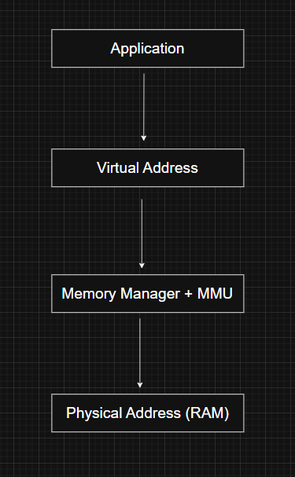
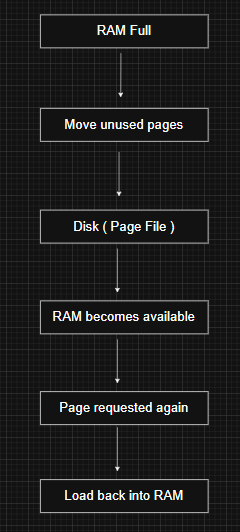
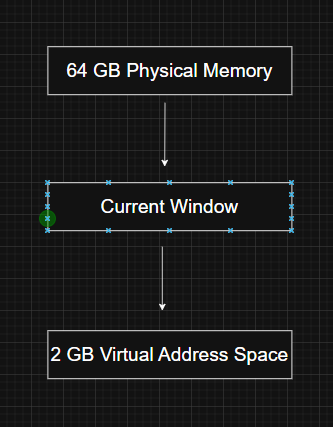
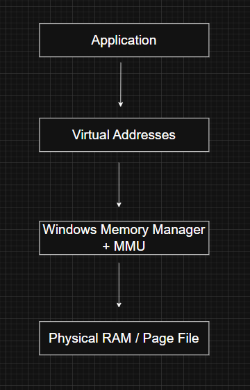

# Virtual Memory

---

# What is Virtual Memory?

Virtual memory is a memory management technique that gives every process its own isolated address space. Instead of allowing applications to work directly with physical RAM, Windows presents each process with a large virtual address space.

When a program accesses memory, it works only with **virtual addresses**. The Windows Memory Manager, together with the processor's Memory Management Unit (MMU), translates those virtual addresses into physical memory locations.

Because every process has its own virtual address space, applications cannot directly access or overwrite another process's memory.

---

# Why does Windows Use Virtual Memory?

Modern operating systems often run many applications at the same time, and the combined memory they require usually exceeds the amount of installed RAM.

Virtual memory solves several problems:

- Provides isolation between processes
- Protects the operating system from user applications
- Allows programs to use more memory than the available physical RAM
- Simplifies application development by presenting a continuous address space
- Improves system stability and security

Without virtual memory, applications would need to know the exact physical location of memory, making multitasking extremely difficult.

---

# How Virtual Memory Works

Every process works with virtual addresses rather than physical ones.

When a process accesses memory:

The translation happens automatically, so applications are unaware of the actual physical location of their data.

---

# Paging

Since the total virtual memory used by running processes is usually much larger than the available RAM, Windows moves less frequently used memory pages from RAM to disk.

This process is called **paging**.

When memory is required:

1. Less frequently used pages are written to disk.
2. Physical RAM becomes available for other processes.
3. If a process later accesses a page that has been moved to disk, Windows loads it back into RAM.

This mechanism is completely transparent to applications.

Because paging is handled by the operating system and supported by the processor hardware, applications do not need to implement any special logic to benefit from it.

---

# Virtual Address Space

Every process receives its own virtual address space.

The size of this address space depends on the system architecture.

## 32-bit Windows

A 32-bit process has a theoretical virtual address space of **4 GB**.

By default, Windows divides it into two regions:

| Address Range               | Usage                     |
| --------------------------- | ------------------------- |
| `0x00000000` – `0x7FFFFFFF` | User-mode memory (2 GB)   |
| `0x80000000` – `0xFFFFFFFF` | Kernel-mode memory (2 GB) |

The lower half is private to the currently running process.

The upper half is reserved for the Windows operating system and remains largely consistent across processes.

---

# Increasing User Address Space

Some applications, such as database servers, require more than the default 2 GB of user-mode virtual memory.

Windows provides the **increaseuserva** boot option, which can increase the user-mode portion to as much as **3 GB**, leaving **1 GB** for the operating system.

For an application to use this larger address space, its executable must be marked as **Large Address Aware**.

Typical configuration:

| User Space | Kernel Space |
|------------|-------------|
| 3 GB | 1 GB |

Although this gives memory-intensive applications more room to operate, reducing the kernel's address space may affect overall system performance.

The **increaseuserva** option also allows administrators to configure user-mode memory anywhere between **2 GB and 3 GB**, depending on system requirements.

---

# Address Windowing Extensions (AWE)

Even with a 3 GB user address space, some applications still require access to much larger amounts of memory.

To support these workloads on 32-bit Windows, Microsoft introduced **Address Windowing Extensions (AWE)**.

AWE allows an application to:

- Allocate up to **64 GB of physical memory**
- Map only a portion (a "window") of that memory into its virtual address space
- Change the mapped window whenever different data is needed

Instead of mapping all memory at once, the application dynamically changes which portion is visible.

Unlike normal virtual memory, the application is responsible for managing these mappings.

AWE was primarily designed for large applications such as database servers that needed access to more physical memory than could fit into a standard 32-bit virtual address space.

---

# Virtual Memory on 64-bit Windows

One of the biggest advantages of 64-bit Windows is its vastly larger virtual address space.

Beginning with Windows 8.1 and Windows Server 2012 R2, each process can access a virtual address space of up to **128 TB**.

This removes many of the limitations found on 32-bit systems and allows modern applications to work with significantly larger data sets.

---

# Virtual Memory Architecture

---

# Windows Internals Relevance

Virtual memory is one of the core responsibilities of the Windows Memory Manager.

Understanding virtual memory is essential before studying:

- Page Tables
- Demand Paging
- Working Sets
- Page Faults
- Memory Allocation
- Process Address Spaces
- Kernel Memory

Many Windows APIs, such as `VirtualAlloc()`, `VirtualFree()`, and `VirtualProtect()`, operate directly on a process's virtual address space.

---

# Red Team Perspective

Virtual memory plays a major role in offensive security.

Common techniques include:

- Process Injection
- Reflective DLL Injection
- Process Hollowing
- Shellcode Execution
- Memory Allocation for Payloads

Frequently used Windows APIs include:

- `VirtualAlloc()`
- `VirtualAllocEx()`
- `VirtualProtect()`
- `VirtualFree()`
- `ReadProcessMemory()`
- `WriteProcessMemory()`

Understanding virtual memory is fundamental for malware development, exploit development, and reverse engineering.

---

# Blue Team Perspective

Security products monitor memory-related activity to identify suspicious behavior.

Examples include:

- Executable memory allocations
- Memory protection changes (RW → RX)
- Cross-process memory access
- Injection into remote processes
- Unusual page protection modifications

Many Endpoint Detection and Response (EDR) solutions correlate memory operations with process and thread activity to detect malicious code execution.

---

# Key Takeaways

- Virtual memory gives every process its own isolated address space.
- Applications work with virtual addresses, while Windows maps them to physical memory.
- Paging allows Windows to move inactive memory pages to disk when RAM is limited.
- A standard 32-bit process has a 4 GB virtual address space, split into user-mode and kernel-mode regions by default.
- The `increaseuserva` boot option can expand user-mode memory up to 3 GB for Large Address Aware applications.
- Address Windowing Extensions (AWE) allow 32-bit applications to work with up to 64 GB of physical memory by mapping portions of it into their address space.
- Modern 64-bit Windows provides up to 128 TB of virtual address space per process.

---

