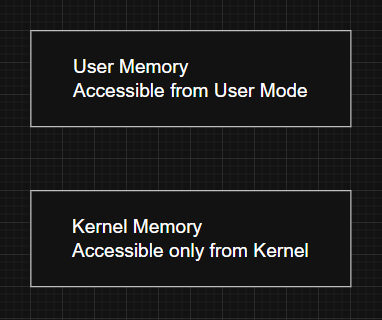
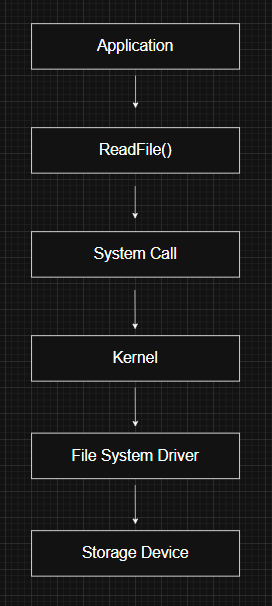
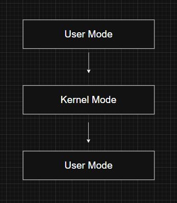
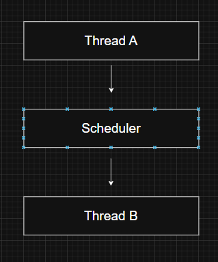
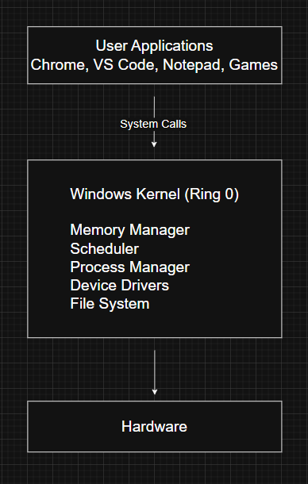

# Kernel Mode vs User Mode

---

# What are User Mode and Kernel Mode?

Windows separates code execution into two different privilege levels:

- **User Mode**
- **Kernel Mode**

This separation prevents applications from directly accessing critical operating system resources.

Applications such as browsers, games, and editors execute in **User Mode**, while the Windows kernel, system services, and device drivers execute in **Kernel Mode**.

Without this separation, a faulty or malicious application could overwrite operating system memory, crash the machine, or bypass security protections.

---

# Why does Windows use Two Modes?

The primary goal is **protection**.

Running applications with limited privileges ensures that a single program cannot compromise the entire operating system.

Some of the benefits include:

- Prevents applications from accessing kernel memory
- Protects hardware resources
- Improves overall system stability
- Prevents unauthorized execution of privileged instructions
- Isolates user applications from each other

This design is one of the most important security mechanisms in modern operating systems.

---

# Processor Privilege Levels (Rings)

The x86 and x64 architectures define four privilege levels known as **rings**.

Windows only uses two of them.

| Ring | Execution Mode |
|------|----------------|
| Ring 0 | Kernel Mode |
| Ring 3 | User Mode |

Although Rings 1 and 2 exist in x86/x64 processors, Windows does not use them.

One reason is portability. Some processor architectures, such as ARM, only provide two privilege levels, so designing Windows around Ring 0 and Ring 3 simplifies the operating system across different hardware platforms.

---

# User Mode

User Mode is where normal applications execute.

Examples include:

- Chrome
- Visual Studio
- Notepad
- Discord
- Steam

Applications running in User Mode have limited privileges.

They cannot:

- Access kernel memory
- Execute privileged CPU instructions
- Communicate directly with hardware
- Modify operating system data structures

If an application crashes in User Mode, Windows usually terminates only that process while the operating system continues running.

---

# Kernel Mode

Kernel Mode provides unrestricted access to the system.

Code executing in Kernel Mode can:

- Access all physical memory
- Access kernel memory
- Execute privileged CPU instructions
- Communicate directly with hardware
- Manage processes and threads
- Control memory management
- Interact with device drivers

Components that normally execute in Kernel Mode include:

- Windows Kernel (`ntoskrnl.exe`)
- Memory Manager
- Process Manager
- Scheduler
- Device Drivers
- File System Drivers

Because Kernel Mode has complete system access, software running there must be highly reliable.

A bug in kernel code often results in a system crash (Blue Screen of Death).

---

# User Mode vs Kernel Mode

| User Mode | Kernel Mode |
|------------|-------------|
| Limited privileges | Full system privileges |
| Cannot access kernel memory | Can access all memory |
| Cannot execute privileged instructions | Can execute all CPU instructions |
| Used by applications | Used by Windows and drivers |
| Crashes usually affect only one application | Crashes can stop the entire operating system |

---

# Memory Protection

Windows uses virtual memory protection to enforce the separation between User Mode and Kernel Mode.

Each page of memory contains protection information indicating who can access it.

Kernel memory cannot be accessed directly from User Mode.

However, Kernel Mode code can access both user memory and kernel memory.

---

# Data Execution Prevention (DEP)

Modern processors support marking memory pages as **non-executable**.

Windows uses this feature through **Data Execution Prevention (DEP)**.

DEP helps prevent attacks where an attacker attempts to execute malicious code stored inside data regions.

Memory pages are typically divided into:

- Executable pages
- Read-only pages
- Read/Write pages
- Non-executable pages

This makes many memory corruption attacks significantly harder.

---

# Kernel Drivers

Device drivers execute in Kernel Mode.

Examples include drivers for:

- Keyboard
- Mouse
- Graphics card
- Network adapter
- Storage devices

Since drivers execute with full system privileges, a faulty driver can corrupt memory or crash Windows.

For this reason, Microsoft requires strict validation for kernel drivers.

---

# Driver Signing

Windows uses **Kernel Mode Code Signing (KMCS)** to ensure only trusted drivers are loaded.

Over time, Microsoft has strengthened these requirements.

### Windows 2000

Introduced driver signing to warn users about unsigned Plug and Play drivers.

---

### Windows 8.1 (64-bit)

Kernel Mode Code Signing became mandatory for kernel drivers.

Unsigned drivers cannot normally be loaded.

Developers testing drivers can enable **Test Mode**, which allows self-signed drivers to load. Windows displays a "Test Mode" watermark on the desktop and disables certain DRM protections while this mode is active.

---

### Windows 10

Starting with Version 1607 (Anniversary Update), newly developed drivers must:

- Use an Extended Validation (EV) certificate
- Be submitted through Microsoft's SysDev portal
- Receive Microsoft's attestation signature before loading

Drivers signed before the enforcement date continue to load under Microsoft's compatibility policy.

---

### Windows Server 2016

Server editions introduced even stricter requirements.

Instead of simple attestation signing, drivers must pass **Windows Hardware Quality Labs (WHQL)** certification before they can load.

WHQL certification verifies:

- Compatibility
- Reliability
- Performance
- Security

This significantly reduces the likelihood of unstable third-party drivers affecting production systems.

---

# Switching Between User Mode and Kernel Mode

Applications cannot directly perform privileged operations.

Instead, they request services from Windows through **system calls**.

Example:

When a system call occurs:

1. The CPU switches from User Mode to Kernel Mode.
2. Windows executes the requested kernel service.
3. The CPU returns to User Mode.
4. Execution continues inside the application.

This transition happens thousands of times per second on a typical Windows system.

---

# Mode Transition vs Context Switch

These two concepts are often confused.

A **mode transition** changes the processor's privilege level.

The same thread continues executing.

A **context switch** occurs when Windows stops executing one thread and schedules another.

During a context switch, Windows saves the execution context of one thread and restores another.

Therefore:

- **Mode Transition ≠ Context Switch**

A thread may enter and leave Kernel Mode many times without ever being switched out by the scheduler.

---

# Graphics and Kernel Mode

Traditional Windows graphics operations rely heavily on Kernel Mode components.

Applications that perform extensive graphics work often spend a significant amount of time transitioning between User Mode and Kernel Mode.

Modern graphics technologies such as **Direct2D** and **DirectComposition** perform more rendering work in User Mode before submitting completed drawing data to the kernel.

This reduces the number of mode transitions and improves performance.

---

# Architecture Overview

---

# Windows Internals Relevance

Understanding execution modes is essential before learning:

- System Calls
- Memory Manager
- Interrupts
- SSDT
- Kernel Objects
- Device Drivers
- Windows Security

Nearly every Windows API eventually transitions from User Mode to Kernel Mode to perform privileged operations.

---

# Red Team Perspective

Many offensive techniques rely on understanding the boundary between User Mode and Kernel Mode.

Examples include:

- Direct System Calls
- Kernel Driver Development
- BYOVD (Bring Your Own Vulnerable Driver)
- Kernel Exploitation
- SSDT Hooking (historically)
- Token Manipulation
- DKOM (Direct Kernel Object Manipulation)

Understanding when execution crosses into Kernel Mode is critical when analyzing malware or developing low-level offensive tooling.

---

# Blue Team Perspective

Defenders closely monitor activity involving Kernel Mode because compromise at this level can bypass many security controls.

Examples include:

- Unsigned driver loading attempts
- Vulnerable driver abuse
- Unexpected kernel memory modifications
- Privilege escalation into Ring 0
- Driver-based rootkits

Modern Windows protections such as KMCS, PatchGuard, Hypervisor-Protected Code Integrity (HVCI), and Microsoft Defender help reduce the attack surface for kernel-level threats.

---

# Key Takeaways

- Windows separates execution into User Mode and Kernel Mode for security and stability.
- Applications execute in User Mode with limited privileges, while the kernel and drivers execute in Kernel Mode with unrestricted access.
- The x86/x64 architecture defines four privilege rings, but Windows uses only Ring 0 and Ring 3 for portability and simplicity.
- Memory protection prevents User Mode code from accessing kernel memory directly.
- Data Execution Prevention (DEP) helps stop code execution from non-executable memory regions.
- Driver signing requirements have become increasingly strict to improve security and reliability.
- A system call performs a temporary transition to Kernel Mode without changing the running thread.
- A mode transition is different from a context switch.

---

# Related Notes

- Windows API
- Processes
- Threads
- Virtual Memory

---

# References

- *Windows Internals, Part 1 (7th Edition)* — Mark Russinovich, David Solomon, Alex Ionescu, Pavel Yosifovich
