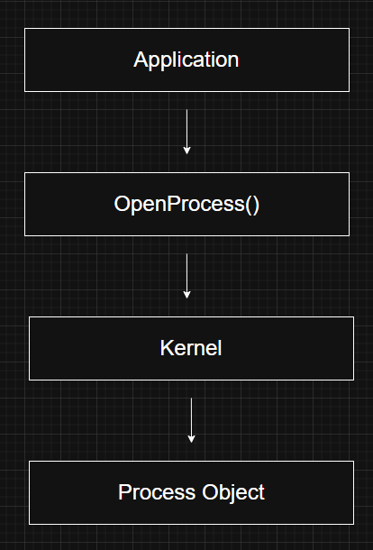
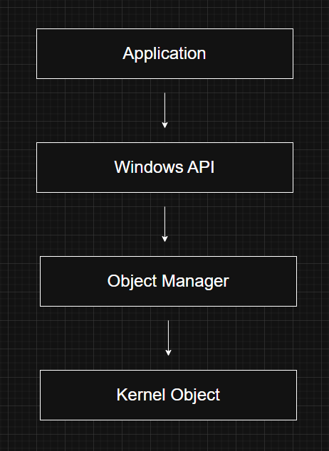
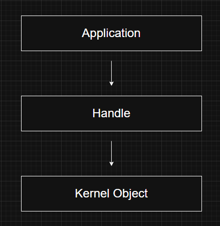
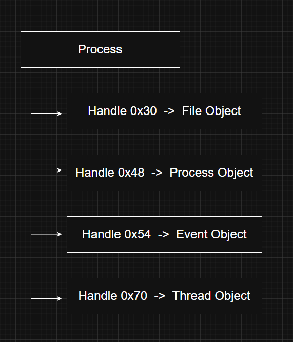
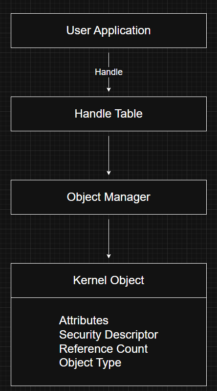

# Objects and Handles

---

# What are Objects?

In Windows, almost every important operating system resource is represented internally as an **object**.

An object is a runtime instance of a predefined **object type** managed by the Windows kernel.

For example:

- A running process is an instance of the **Process** object type.
- A thread is an instance of the **Thread** object type.
- An open file is an instance of the **File** object type.
- A synchronization event is an instance of the **Event** object type.

Objects provide a consistent way for Windows to manage resources while enforcing security and resource sharing.

---

# Why does Windows use Objects?

Instead of allowing applications to manipulate low-level kernel structures directly, Windows wraps important resources inside objects.

This approach provides several advantages:

- Standardized resource management
- Built-in security
- Controlled access to system resources
- Easier resource sharing
- Automatic lifetime management

Without objects, every kernel component would need to implement its own resource management mechanism.

---

# Object Types

An **object type** defines the blueprint for a category of kernel objects.

It specifies:

- The data stored in the object
- The operations that can be performed
- The attributes associated with the object

Examples of object types include:

- Process
- Thread
- File
- Event
- Mutex
- Semaphore
- Section
- Token
- Job

Every object created by Windows belongs to one of these object types.

---

# Object Attributes

Each object stores information describing its current state.

These pieces of information are called **attributes**.

For example, a Process object may contain attributes such as:

- Process ID (PID)
- Base priority
- Process state
- Pointer to its access token
- Handle table
- Virtual address space information

Different object types have different sets of attributes depending on their purpose.

---

# Object Methods

Objects cannot be modified directly.

Instead, Windows exposes functions (often called **methods**) that operate on them.

These methods may:

- Create an object
- Open an existing object
- Read object information
- Modify object attributes
- Delete an object

For example:

The application requests access to the process through an API rather than manipulating the Process object itself.

---

# Why are Objects Opaque?

One important property of Windows objects is that their internal structure is **hidden** (opaque).

Applications cannot directly inspect or modify an object's internal memory.

Instead, they must use Windows APIs to interact with it.

This provides several benefits:

- Prevents accidental corruption
- Improves security
- Allows Microsoft to change internal implementations without breaking applications
- Maintains compatibility across Windows versions

In other words, applications interact with objects through well-defined interfaces instead of accessing their internal fields.

---

# Object Manager

Windows includes a kernel component called the **Object Manager**.

The Object Manager is responsible for creating, tracking, securing, and destroying kernel objects.

It provides a common infrastructure used throughout the operating system.

Many kernel components rely on the Object Manager rather than implementing their own object management logic.

---

# Responsibilities of the Object Manager

The Object Manager performs several important tasks.

## 1. Naming System Resources

Many kernel objects can have human-readable names.

Named objects allow multiple applications to locate and share the same resource.

---

## 2. Resource Sharing

Objects provide a safe mechanism for sharing resources between processes.

Examples include:

- Shared memory
- Synchronization objects
- Files
- Named pipes

Instead of creating duplicate resources, multiple processes can reference the same kernel object.

---

## 3. Security

Every kernel object has an associated security descriptor.

When a process attempts to access an object, Windows checks whether the process has sufficient permissions.

This allows Windows to enforce access control for resources such as:

- Files
- Processes
- Threads
- Registry keys
- Events

---

## 4. Reference Tracking

Windows keeps track of how many references exist to every object.

Whenever a process opens an object, the reference count increases.

When a handle is closed, the reference count decreases.

Once no references remain, Windows automatically destroys the object and releases its memory.

This prevents resource leaks and simplifies memory management.

---

# What is a Handle?

Applications do not access kernel objects directly.

Instead, Windows provides a **handle**.

A handle is an identifier that refers to a kernel object.

Think of it as a secure reference or "ticket" that allows an application to interact with the object.

The application never receives the object's actual memory address.

---

# Why are Handles Used?

Handles provide an additional layer of protection.

Instead of exposing kernel memory:

- Applications receive handles.
- The kernel validates every handle.
- Security checks occur whenever the handle is used.

This prevents applications from directly modifying kernel structures.

---

# Handle Table

Each process maintains its own **handle table**.

When an application calls a Windows API such as `ReadFile()`, Windows uses the supplied handle to locate the corresponding kernel object.

---

# Objects vs Handles

| Object | Handle |
|---------|---------|
| Actual kernel resource | Reference to an object |
| Exists in kernel memory | Exists in a process's handle table |
| Managed by the Object Manager | Managed by the process |
| Stores object data | Used to access the object |

Applications work with handles rather than objects directly.

---

# Not Everything is an Object

Although Windows uses objects extensively, not every internal data structure is implemented as one.

Objects are generally used only when the resource needs one or more of the following:

- Sharing between processes
- Security protection
- A human-readable name
- Access from user mode
- Automatic lifetime management

Internal structures used only by a single kernel component often remain ordinary data structures instead of full kernel objects.

This keeps the operating system more efficient by avoiding unnecessary object management overhead.

---

# Object Architecture

---

# Windows Internals Relevance

Kernel objects form the foundation of many Windows components.

Understanding objects is essential before studying:

- Handles
- Object Manager
- Security Descriptors
- Access Tokens
- Processes
- Threads
- File System
- Synchronization

Nearly every Windows API interacts with one or more kernel objects.

---

# Red Team Perspective

Many offensive techniques rely on interacting with kernel objects.

Examples include:

- Opening remote processes
- Duplicating handles
- Stealing process handles
- Token manipulation
- Handle inheritance abuse

Frequently used Windows APIs include:

- `OpenProcess()`
- `OpenThread()`
- `DuplicateHandle()`
- `CloseHandle()`
- `CreateFile()`

Understanding handles is critical for process injection, privilege escalation, and malware development.

---

# Blue Team Perspective

Security tools monitor object and handle activity to detect malicious behavior.

Examples include:

- Unusual process handle creation
- Handle duplication into privileged processes
- Unauthorized access to sensitive objects
- Excessive handle leaks
- Attempts to access protected processes

Many EDR solutions correlate handle activity with process and memory events to identify attacks.

---

# Key Takeaways

- A kernel object represents a runtime instance of a predefined object type.
- Objects encapsulate important operating system resources such as processes, threads, files, and synchronization primitives.
- Applications interact with objects through Windows APIs rather than modifying them directly.
- The Object Manager is responsible for naming, securing, sharing, and tracking kernel objects.
- Handles provide a secure way for applications to reference kernel objects.
- Each process maintains its own handle table.
- Reference counting allows Windows to automatically release objects when they are no longer in use.
- Not every internal Windows data structure is implemented as an object—only those that require sharing, security, naming, or user-mode visibility.

---

# Related Notes

- Windows API
- Processes
- Threads
- Virtual Memory
- Kernel Mode vs User Mode

---

