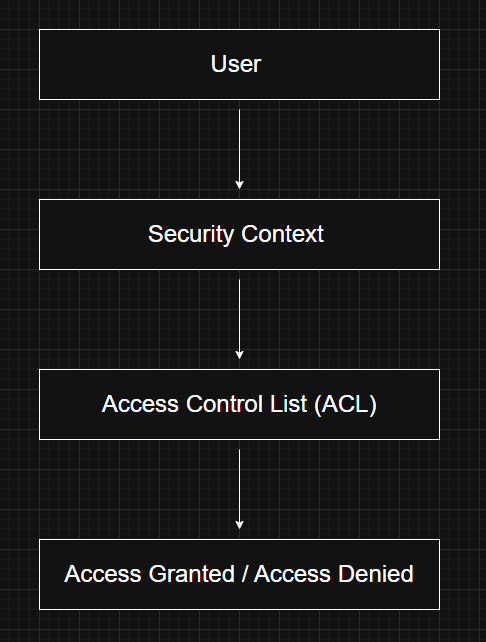
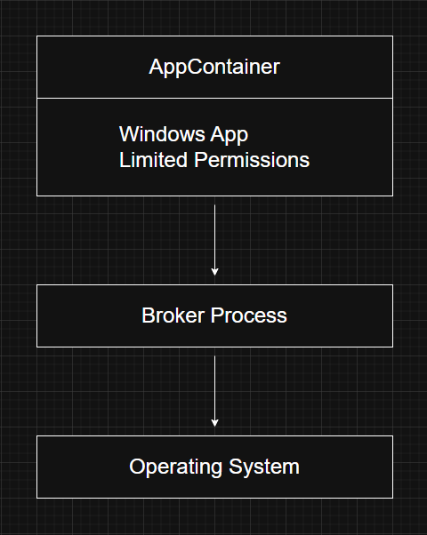
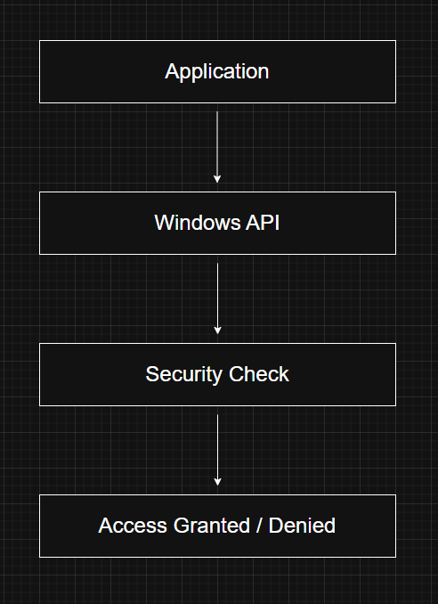
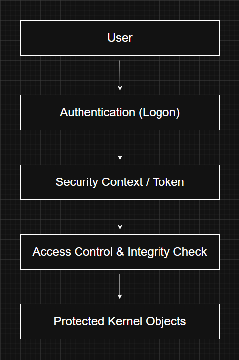

# Security

---

# What is Windows Security?

Windows was designed with security as one of its core principles. From the beginning, the operating system was built to support multi-user environments where different users and applications share the same computer without interfering with each other.

To achieve this, Windows provides mechanisms that:

- Authenticate users
- Protect operating system resources
- Control access to shared objects
- Record security-related events
- Prevent unauthorized access to data

Many of these features also help Windows satisfy industry and government security standards such as the **Common Criteria for Information Technology Security Evaluation (CCITSE)**.

---

# Why is Security Important?

Without proper security controls, any user or application could:

- Read another user's files
- Modify system resources
- Execute privileged operations
- Access confidential information
- Compromise the stability of the operating system

Windows uses multiple security layers to ensure that every action is checked before access is granted.

---

# Core Security Capabilities

Windows provides several built-in security mechanisms.

## 1. Object Protection

Windows protects shared kernel objects such as:

- Files
- Directories
- Processes
- Threads
- Registry Keys
- Events
- Mutexes
- Semaphores

Every protected object can have permissions that determine who is allowed to access it.

---

## 2. Security Auditing

Windows records security-related events to provide accountability.

Examples include:

- User logons
- Failed logon attempts
- File access
- Privilege usage
- Process creation
- Security policy changes

These audit logs help administrators investigate suspicious activity and perform forensic analysis.

---

## 3. User Authentication

Before a user gains access to the operating system, Windows verifies their identity.

Authentication may involve:

- Passwords
- Windows Hello
- Smart Cards
- Biometrics
- Domain Credentials (Active Directory)

After successful authentication, Windows creates a security context for the user.

---

## 4. Protection of Released Resources

When memory or disk space is released by one user or process, Windows ensures that another user cannot access leftover data.

Before resources are reused, Windows clears or reinitializes them to prevent accidental disclosure of sensitive information.

---

# Access Control in Windows

Windows controls access to resources using three primary mechanisms.

---

# 1. Discretionary Access Control (DAC)

Discretionary Access Control is the standard permission model used throughout Windows.

The owner of an object determines who can access it and what operations they are allowed to perform.

Examples include permissions on:

- Files
- Folders
- Printers
- Registry Keys

When a user attempts to access an object:

Windows compares the user's security context with the object's Access Control List (ACL).

If the requested permission exists, access is granted.

Otherwise, access is denied.

---

# Dynamic Access Control (DAC - Windows Server 2012+)

Windows Server 2012 and Windows 8 introduced **Dynamic Access Control**, an extension of the traditional discretionary model.

Instead of relying only on users and groups, permissions can also depend on **attributes** or **claims**.

Examples:

Clearance Level = Top Secret
Department = Finance
Years of Service >= 10

These attributes can be automatically retrieved from **Active Directory**.

Benefits include:

- Reduced group management
- More flexible authorization
- Easier policy administration
- Better scalability in enterprise environments

---

# 2. Privileged Access Control

Sometimes object owners are unavailable.

For example:

- An employee leaves the company.
- Important files remain inaccessible.
- The administrator needs access.

Windows allows privileged users, such as administrators, to **take ownership** of an object.

Once ownership changes, permissions can be modified to regain access.

This mechanism ensures that important resources are never permanently inaccessible.

---

# 3. Mandatory Integrity Control (MIC)

Discretionary permissions alone are not always sufficient.

Windows also uses **Mandatory Integrity Control (MIC)** to restrict interactions between processes running under the same user account.

Every process and object receives an **Integrity Level**, such as:

- Low
- Medium
- High
- System

A lower integrity process cannot modify an object owned by a higher integrity process, even if the discretionary permissions would normally allow it.

Examples include:

- Protected Mode Internet Explorer
- Modern web browsers
- User Account Control (UAC)
- Elevated administrator processes

MIC helps reduce the impact of compromised applications.

---

# AppContainer

Starting with Windows 8, Microsoft introduced **AppContainer**.

AppContainer is a sandboxing technology designed to isolate applications from the rest of the system.

Applications running inside an AppContainer have very limited access to system resources.

Instead of communicating directly with sensitive resources, AppContainer applications interact with trusted **broker processes** through well-defined Windows Runtime interfaces.

This significantly reduces the damage an exploited application can cause.

---

# Microsoft Edge and AppContainer

Microsoft Edge was designed to run inside an AppContainer.

If malicious code executes inside the browser, it remains confined within the sandbox and cannot freely access user files or operating system resources.

This isolation provides an additional layer of protection against browser-based attacks.

---

# AppContainer for Third-Party Applications

AppContainer is not limited to Microsoft's applications.

Third-party developers can also use AppContainers to isolate their own applications.

This encourages developers to build applications using multiple isolated processes rather than one large process with unrestricted access.

---

# Security in the Windows API

Security is integrated throughout the Windows API.

Many Windows objects have an associated **Security Descriptor**.

Examples include:

- Files
- Events
- Processes
- Threads
- Registry Keys

Whenever an application attempts to access one of these objects:

Windows verifies the caller's permissions before allowing the requested operation.

This security check occurs transparently and is fundamental to the Windows security model.

---

# Windows Security Architecture

---

# Windows Internals Relevance

Security is deeply integrated into almost every Windows subsystem.

Understanding Windows security is essential before studying:

- Access Tokens
- Security Descriptors
- ACLs
- UAC
- Logon Sessions
- LSASS
- Active Directory
- Object Manager

Nearly every system call that accesses a protected resource performs a security check.

---

# Red Team Perspective

Understanding the Windows security model is critical for offensive security.

Common attack techniques target:

- Token Theft
- Privilege Escalation
- UAC Bypass
- ACL Misconfigurations
- AppContainer Escapes
- Access Token Manipulation
- Privileged Handle Abuse

Many post-exploitation techniques rely on understanding how Windows grants and restricts access to protected objects.

---

# Blue Team Perspective

Defenders rely heavily on Windows security mechanisms to detect and prevent attacks.

Examples include:

- Monitoring authentication events
- Auditing privilege usage
- Detecting abnormal access token activity
- Reviewing ACL changes
- Monitoring integrity level violations
- Detecting sandbox escape attempts

Security logs generated by Windows are essential during incident response and forensic investigations.

---

# Key Takeaways

- Windows security is based on authentication, authorization, auditing, and resource protection.
- Every user receives a security context after successful authentication.
- Discretionary Access Control uses ACLs to determine access permissions.
- Dynamic Access Control extends traditional ACLs by using user attributes and claims.
- Privileged Access Control allows administrators to recover access to protected resources.
- Mandatory Integrity Control prevents lower-integrity processes from modifying higher-integrity objects.
- AppContainer isolates applications inside secure sandboxes.
- The Windows API performs security checks before allowing access to protected objects.

---

# Related Notes

- Objects and Handles
- Processes
- Threads
- Kernel Mode vs User Mode

---

