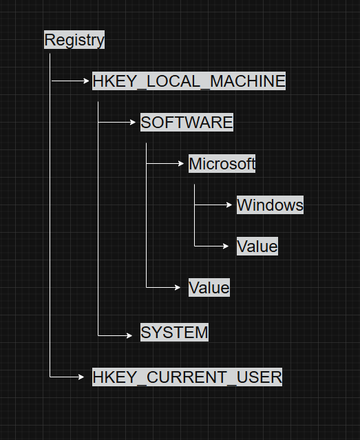
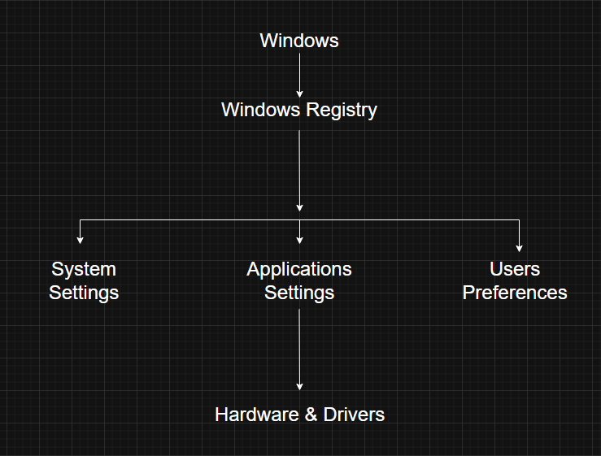

# Registry

---

# What is the Windows Registry?

The **Windows Registry** is a centralized hierarchical database that stores configuration information used by both the operating system and installed applications.

Windows relies on the registry during startup and throughout normal operation. It contains settings that control system behavior, hardware configuration, user preferences, software configuration, and security-related information.

Unlike configuration files scattered across the system, the registry provides a single location for storing and retrieving configuration data.

---

# Why does Windows use the Registry?

Windows needs a reliable way to store settings that persist even after a reboot.

The registry provides this by allowing Windows and applications to:

- Store operating system configuration
- Save application settings
- Keep hardware configuration information
- Maintain user preferences
- Store security-related information
- Expose certain runtime system information

Without the registry, every application would need to manage its own configuration files, making administration much more complicated.

---

# What Information Does the Registry Store?

The registry stores a wide range of configuration data.

Some common examples include:

- Windows boot configuration
- Installed software settings
- Device driver configuration
- User profile settings
- Desktop personalization
- Network configuration
- Security configuration
- File associations
- Startup programs

It acts as one of the primary databases used by Windows.

---

# Registry Structure

The registry is organized as a hierarchical tree.

The hierarchy consists of:

- Hives
- Keys
- Subkeys
- Values

This structure is similar to folders and files in a filesystem.

---

# Registry Hives

The top-level sections of the registry are called **hives**.

Some common hives include:

| Hive | Purpose |
|------|----------|
| HKEY_LOCAL_MACHINE (HKLM) | System-wide configuration |
| HKEY_CURRENT_USER (HKCU) | Current user's settings |
| HKEY_CLASSES_ROOT (HKCR) | File associations and COM information |
| HKEY_USERS (HKU) | All user profiles |
| HKEY_CURRENT_CONFIG (HKCC) | Current hardware profile |

Each hive stores a different category of configuration data.

---

# Volatile Data

Not everything exposed through the registry is permanently stored on disk.

Some registry information exists only while Windows is running.

Examples include:

- Loaded device drivers
- Current hardware state
- Resource allocations
- Runtime system information

This data is generated dynamically and disappears after the system shuts down.

---

# Performance Counters

Windows exposes system performance information through registry-related interfaces.

Examples include:

- CPU usage
- Memory usage
- Disk activity
- Network statistics

Although older Windows versions allowed these counters to be accessed through registry APIs, modern Windows provides newer and more efficient APIs specifically designed for performance monitoring.

---

# Registry During Boot

The registry plays an important role during system startup.

During boot, Windows reads registry information to determine:

- Which drivers should load
- Which services should start
- Hardware configuration
- System settings
- Boot options

Without the registry, Windows would not know how to initialize many parts of the operating system.

---

# Registry and User Settings

Windows also stores user-specific preferences inside the registry.

Examples include:

- Desktop wallpaper
- Screen saver
- Mouse settings
- Keyboard preferences
- Installed application settings

Each user account has its own registry settings, allowing different users on the same computer to have different configurations.

---

# Registry and Applications

Applications frequently use the registry to save configuration information.

Common examples include:

- Installation paths
- License information
- User preferences
- Update settings
- Recently opened files

Instead of creating separate configuration files, many Windows applications store these settings directly in the registry.

---

# Registry Architecture

---

# Common Registry Tools

Windows provides several utilities for working with the registry.

Some commonly used tools include:

- Registry Editor (`regedit.exe`)
- Command Prompt (`reg.exe`)
- PowerShell Registry Provider

These tools allow administrators to view, modify, export, and import registry data.

---

# Why Editing the Registry is Risky

The registry controls many critical operating system settings.

Changing incorrect values can lead to problems such as:

- System instability
- Driver failures
- Software malfunction
- Boot failures
- Security issues

For this reason, registry modifications should always be performed carefully, and important registry data should be backed up before making changes.

---

# Windows Internals Relevance

The registry appears throughout Windows Internals.

Many important topics depend on understanding it, including:

- System Startup
- Services
- Device Drivers
- User Profiles
- Security
- Driver Configuration
- Persistence Mechanisms

Understanding the registry makes it much easier to analyze how Windows stores and retrieves configuration data.

---

# Red Team Perspective

The Windows Registry is frequently abused by attackers.

Common techniques include:

- Persistence using Run and RunOnce keys
- Service creation
- Stored credential discovery
- COM hijacking
- DLL search order manipulation
- Registry-based malware configuration
- UAC bypass techniques

Registry analysis is often one of the first steps during malware investigations.

---

# Blue Team Perspective

Defenders continuously monitor registry activity for signs of malicious behavior.

Examples include:

- Unexpected autorun entries
- New services
- Changes to security settings
- Registry persistence mechanisms
- Suspicious software installation
- Unauthorized configuration changes

Many EDR products generate alerts when sensitive registry keys are modified.

---

# Key Takeaways

- The Windows Registry is the central configuration database used by Windows.
- It stores operating system settings, application configuration, hardware information, security data, and user preferences.
- The registry follows a hierarchical structure made up of hives, keys, subkeys, and values.
- Some registry information is permanent, while other data exists only during system runtime.
- Windows uses the registry extensively during boot to determine which drivers and services should load.
- Applications commonly use the registry to store configuration and preference data.
- Incorrect registry modifications can cause serious system problems, including boot failures.
- Understanding the registry is essential for Windows Internals, malware analysis, digital forensics, and system administration.

---

# Related Notes

- Windows API
- Objects and Handles
- Security
- Processes
- Threads

---

