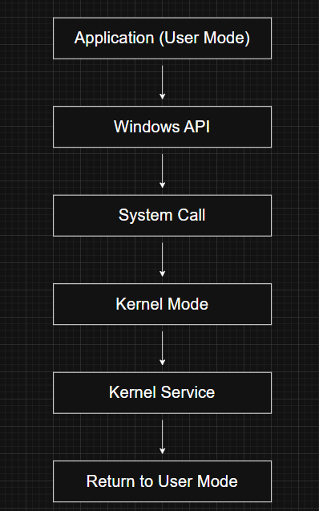
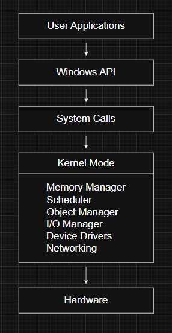

# Operating System Model

---

# What is the Operating System Model?

An operating system model defines how applications interact with the operating system and how system resources are managed.

Modern operating systems separate user applications from the operating system itself. This separation improves security, stability, and reliability by preventing applications from directly accessing sensitive system resources.

Windows follows this same approach by running applications and operating system components in different processor privilege levels.

---

# Why is this Separation Necessary?

If every application had unrestricted access to hardware and system memory, a single faulty or malicious program could:

- Crash the operating system
- Corrupt system memory
- Modify critical system data
- Access hardware directly
- Interfere with other running applications

To avoid these problems, Windows isolates applications from the operating system.

---

# User Mode and Kernel Mode

Windows operates using two primary processor modes:

## User Mode

Applications execute in **User Mode**, where they have limited privileges.

Programs running in user mode:

- Cannot directly access hardware
- Cannot execute privileged CPU instructions
- Cannot modify kernel memory
- Must request operating system services through the Windows API

This isolation prevents applications from affecting the stability of the entire system.

---

## Kernel Mode

Core operating system components execute in **Kernel Mode**.

Kernel mode has unrestricted access to:

- Physical memory
- Hardware devices
- CPU instructions
- Kernel data structures

Because of these privileges, kernel-mode components can perform tasks that user applications cannot.

Examples include:

- Memory management
- Process scheduling
- File system operations
- Networking
- Device communication

---

# System Call Flow

When an application requires an operating system service, it cannot perform the operation directly.

Instead, it requests the service through the Windows API.

The execution flow is:

The processor temporarily switches from **User Mode** to **Kernel Mode**, executes the requested service, and then returns control to the application.

This transition happens thousands of times per second during normal system operation.

---

# Windows is a Monolithic Operating System

Windows follows a **monolithic kernel** design.

In a monolithic operating system:

- Most operating system components execute inside kernel mode.
- Device drivers also execute in kernel mode.
- These components share the same protected kernel memory space.

Examples include:

- Memory Manager
- Scheduler
- Object Manager
- I/O Manager
- Cache Manager
- Device Drivers

Because everything shares the same address space, communication between components is efficient.

---

# Advantages of a Monolithic Kernel

A monolithic design provides several benefits:

- High performance
- Fast communication between kernel components
- Efficient system service execution
- Low overhead for system calls

These characteristics make Windows responsive for operations such as:

- File I/O
- Virtual memory management
- Networking
- Process management

---

# Disadvantages of a Monolithic Kernel

Sharing kernel memory also introduces risks.

If a kernel component or device driver contains a bug, it can:

- Corrupt kernel memory
- Crash the operating system
- Cause a Blue Screen of Death (BSOD)
- Affect unrelated kernel components

Unlike user-mode applications, kernel-mode code is not isolated from other kernel components.

---

# How Windows Reduces Kernel Risks

Because third-party drivers execute in kernel mode, Microsoft has introduced several mechanisms to improve system security and reliability.

Examples include:

- **WHQL (Windows Hardware Quality Labs)** certification
- **KMCS (Kernel Mode Code Signing)**
- **Virtualization-Based Security (VBS)**
- **Device Guard**
- **Hyper Guard**

These technologies help ensure that only trusted and properly tested drivers execute in kernel mode.

---

# Protection from User Applications

Although kernel components share memory with one another, they remain fully protected from user-mode applications.

Applications cannot:

- Access kernel memory directly
- Execute privileged instructions
- Communicate with hardware without using system services

Instead, applications must rely on Windows APIs to interact with the operating system.

This isolation is one of the reasons Windows remains stable even when individual applications crash.

---

# Object-Oriented Design Principles

Although Windows is primarily written in the C programming language, many kernel components follow object-oriented design concepts.

For example:

- Components communicate through defined interfaces.
- Internal data structures remain hidden.
- Components avoid directly modifying each other's internal data.

This modular design improves maintainability and allows internal implementations to change without affecting other components.

---

# Is Windows Object-Oriented?

Not entirely.

Windows is **not a true object-oriented operating system**.

Most kernel code is written in **C**, which does not natively support features such as:

- Classes
- Inheritance
- Polymorphism

Instead, Windows implements its own object model using C structures, function pointers, and well-defined interfaces.

This approach provides many of the advantages of object-oriented design while maintaining portability and performance.

---

# Operating System Model Overview

---

# Windows Internals Relevance

Understanding the operating system model is essential before studying:

- Executive
- Kernel
- Object Manager
- Memory Manager
- Scheduler
- Device Drivers
- System Calls
- Windows API

Nearly every Windows subsystem operates according to this architecture.

---

# Red Team Perspective

Many offensive security techniques target the boundary between user mode and kernel mode.

Examples include:

- Kernel exploits
- Vulnerable drivers
- BYOVD (Bring Your Own Vulnerable Driver)
- Direct system calls
- Driver abuse
- Kernel rootkits

Understanding how Windows transitions between privilege levels is fundamental for advanced exploit development and malware research.

---

# Blue Team Perspective

Defenders rely on the operating system model to enforce security boundaries.

Security mechanisms include:

- Kernel Mode Code Signing (KMCS)
- Driver verification
- Virtualization-Based Security (VBS)
- Device Guard
- Hyper Guard
- Monitoring suspicious driver loading

Protecting the kernel is one of the most important aspects of securing a Windows system.

---

# Key Takeaways

- Windows separates applications from the operating system using User Mode and Kernel Mode.
- Applications must use system calls to request privileged services.
- Windows uses a monolithic kernel where most OS components share kernel memory.
- Monolithic kernels provide excellent performance but increase the impact of faulty kernel components.
- Microsoft uses technologies such as KMCS, WHQL, VBS, Device Guard, and Hyper Guard to improve kernel security.
- Although Windows uses object-oriented design principles, it is primarily implemented in C and is not a fully object-oriented operating system.

---

# Related Notes

- Requirements and Design Goals
- Windows API
- Kernel Mode vs User Mode
- Processes
- Threads
- Objects and Handles
- System Calls *(Coming Soon)*
- Executive *(Coming Soon)*
- Kernel *(Coming Soon)*

---

