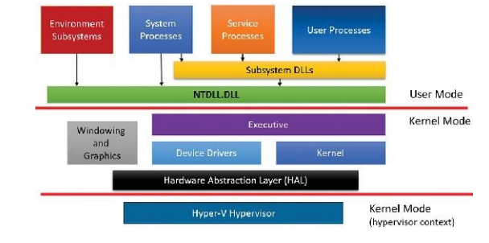
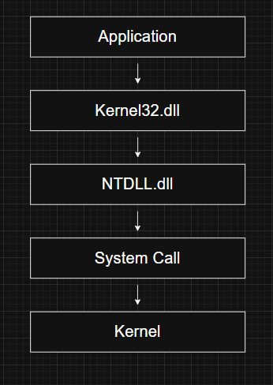

# Windows Architecture Overview

---

# What is the Windows Architecture?

Windows follows a layered architecture that separates **user-mode components**, **kernel-mode components**, and the **hardware**.

This separation improves security, stability, portability, and maintainability. User applications cannot directly communicate with hardware or modify operating system memory. Instead, they interact with Windows through documented APIs and system calls.

The simplified Windows architecture is shown below.

---

# Why is Windows Layered?

Windows separates responsibilities into different layers for several reasons:

- Protect the operating system from applications
- Isolate hardware-specific code
- Improve portability across hardware platforms
- Allow applications to communicate with the OS through standard interfaces
- Reduce system crashes caused by faulty applications

Each layer has a well-defined responsibility.

---

# High-Level Architecture

The Windows architecture can be divided into three major parts:

- User Mode
- Kernel Mode
- Hypervisor Layer (when virtualization is enabled)

Each layer communicates only through controlled interfaces.

---

# User Mode

Everything above the User Mode / Kernel Mode boundary runs with limited privileges.

Every process has its own private virtual address space, preventing one application from directly accessing another application's memory.

Windows user-mode components include:

- User Processes
- Service Processes
- System Processes
- Environment Subsystems
- Subsystem DLLs
- NTDLL.DLL

Applications running in user mode cannot directly:

- Access hardware
- Execute privileged CPU instructions
- Modify kernel memory

Instead, they request operating system services through Windows APIs.

---

# Types of User-Mode Processes

Windows contains four major categories of user-mode processes.

---

## 1. User Processes

These are normal applications started by users.

Examples include:

- Microsoft Word
- Google Chrome
- Visual Studio Code
- Windows Store Apps
- Notepad

Historically, Windows also supported:

- Windows 3.1 (16-bit)
- MS-DOS applications
- POSIX applications

Modern Windows supports only Windows applications.

---

## 2. Service Processes

Service processes host Windows Services.

Unlike regular applications, services can run without any user being logged into the system.

Examples include:

- Task Scheduler
- Print Spooler
- Windows Update
- SQL Server
- Microsoft Exchange

Services are typically started automatically during system boot.

---

## 3. System Processes

These are special Windows processes created directly by the operating system.

Unlike services, they are **not** started by the Service Control Manager.

Examples include:

- Session Manager (SMSS)
- Logon Process (Winlogon)
- Client Server Runtime (CSRSS)

These processes are essential for Windows to operate correctly.

---

## 4. Environment Subsystems

Environment subsystems provide compatibility with different operating system environments.

Historically Windows included:

- Windows Subsystem
- POSIX Subsystem
- OS/2 Subsystem

Later versions introduced:

- Subsystem for UNIX-based Applications (SUA)

Most of these compatibility subsystems have now been removed from modern Windows.

---

# Subsystem DLLs

Applications rarely communicate directly with the Windows kernel.

Instead, they call functions provided by **Subsystem DLLs**.

Examples include:

- Kernel32.dll
- User32.dll
- Advapi32.dll
- Gdi32.dll

These DLLs translate documented Windows API functions into native system calls.

---

# NTDLL.DLL

Almost every Windows application eventually reaches **NTDLL.DLL**.

NTDLL acts as the bridge between user mode and kernel mode.

Responsibilities include:

- Native API implementation
- System call stubs
- Transition to kernel mode

Applications usually do not call NTDLL directly.

Instead:

---

# Kernel Mode

Everything below the user/kernel boundary executes with full system privileges.

Kernel-mode code has unrestricted access to:

- Physical memory
- Hardware devices
- CPU instructions
- Kernel data structures

This layer contains the core operating system.

---

# Executive

The **Executive** provides high-level operating system services.

Major responsibilities include:

- Process management
- Thread management
- Virtual memory
- Security
- Networking
- I/O management
- Inter-process communication

Most Windows Internals topics revolve around Executive components.

---

# Kernel

The Windows Kernel performs low-level operating system operations.

Examples include:

- Thread scheduling
- Interrupt handling
- Exception dispatching
- Processor synchronization
- Context switching

The Executive depends on the Kernel for these fundamental services.

---

# Device Drivers

Device drivers allow Windows to communicate with hardware.

Windows supports two major categories:

### Hardware Drivers

Examples:

- GPU drivers
- Keyboard drivers
- Disk drivers
- USB drivers

### Software Drivers

Examples:

- File System Drivers
- Network Drivers
- Filter Drivers

Drivers execute in kernel mode and therefore have full system privileges.

---

# Hardware Abstraction Layer (HAL)

Different computers contain different hardware.

Instead of requiring Windows to understand every motherboard or chipset directly, the **Hardware Abstraction Layer (HAL)** provides a common interface.

HAL hides hardware-specific differences from:

- Kernel
- Executive
- Device Drivers

This greatly improves Windows portability.

---

# Windowing and Graphics System

Windows also contains kernel-mode components responsible for graphical operations.

These implement:

- Windows (USER)
- Graphics Device Interface (GDI)
- Window Management
- Drawing
- User Interface Controls

Applications rely on these services to display graphical interfaces.

---

# Hypervisor Layer

Modern Windows includes Microsoft's Hyper-V hypervisor.

Although it executes using the same processor privilege level as the kernel, it operates underneath Windows using hardware virtualization extensions.

Examples include:

- Intel VT-x
- AMD SVM

Because it controls the operating system itself, people often refer to the hypervisor as operating in **Ring -1**.

Technically, Ring -1 is not an actual CPU privilege ring but rather a conceptual term describing the virtualization layer.

---

# Responsibilities of the Hypervisor

The Hyper-V hypervisor performs many functions, including:

- Virtual machine management
- Virtual processor scheduling
- Memory virtualization
- Interrupt management
- Timer management
- Synchronization
- Inter-partition communication

Modern Windows security features also depend on the hypervisor.

Examples include:

- Virtualization-Based Security (VBS)
- Credential Guard
- Hypervisor-Protected Code Integrity (HVCI)

---

# Windows Internals Relevance

Understanding this architecture is essential before studying:

- Executive
- Kernel
- Memory Manager
- Object Manager
- I/O Manager
- Process Manager
- Scheduler
- Device Drivers
- System Calls

Almost every Windows Internals topic builds upon this architecture.

---

# Red Team Perspective

Understanding Windows architecture helps explain how attackers interact with the operating system.

Examples include:

- Direct system calls
- User-mode API hooking
- Kernel exploitation
- Driver abuse
- BYOVD (Bring Your Own Vulnerable Driver)
- DLL injection
- NTDLL unhooking

Knowing where each component executes helps identify potential attack surfaces.

---

# Blue Team Perspective

Defenders use this architecture to understand how Windows protects itself.

Examples include:

- Driver signing
- Hypervisor-Based Security
- User/Kernel isolation
- Monitoring system calls
- Detecting malicious drivers
- Kernel integrity validation

Understanding these components helps during malware analysis and incident response.

---

# Key Takeaways

- Windows uses a layered architecture consisting of User Mode, Kernel Mode, and an optional Hypervisor layer.
- User applications access operating system functionality through Subsystem DLLs and NTDLL.dll.
- The Executive provides high-level operating system services, while the Kernel handles low-level processor operations.
- Device drivers execute in kernel mode and have unrestricted system access.
- The HAL isolates Windows from hardware-specific differences.
- Hyper-V provides virtualization services that support both virtual machines and modern Windows security features.
- Understanding this architecture is fundamental for Windows Internals, malware analysis, exploit development, and system debugging.

---

# Related Notes

- Requirements and Design Goals
- Operating System Model
- Windows API
- Kernel Mode vs User Mode
- Processes
- Threads
- Virtual Memory
- Objects and Handles
- Security
- Hardware Abstraction Layer (Coming Soon)
- Executive (Coming Soon)
- Kernel (Coming Soon)

---

