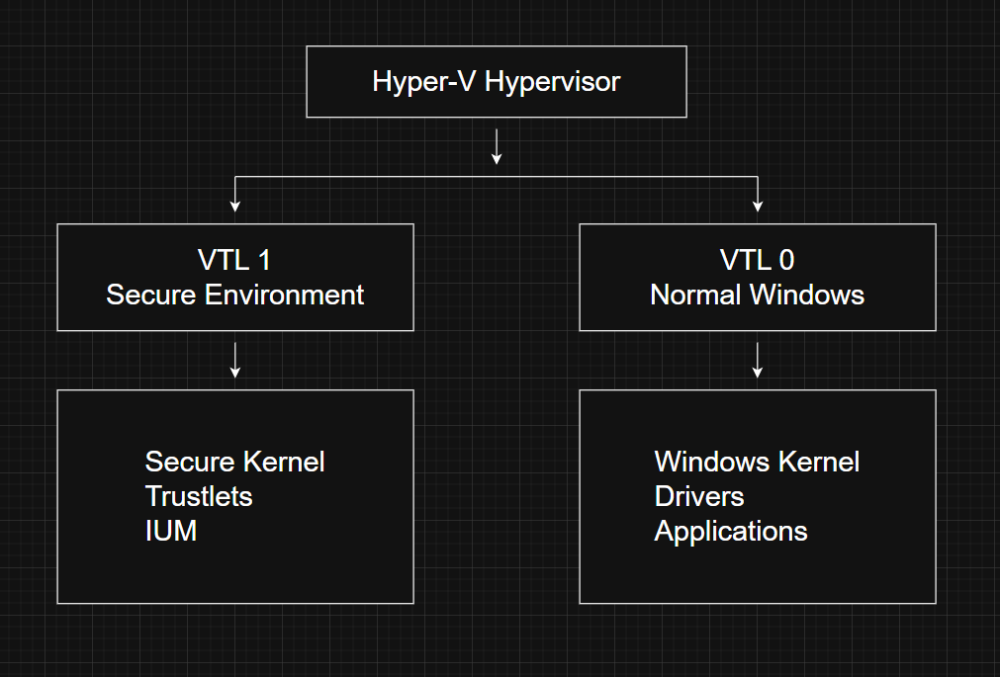

# Virtualization-Based Security (VBS)

---
# What is Virtualization-Based Security (VBS)?

Virtualization-Based Security (VBS) is a Windows security feature that uses the Hyper-V hypervisor to isolate sensitive operating system components from the normal Windows kernel.

Traditionally, Windows relies on **User Mode** and **Kernel Mode** for protection. User-mode applications cannot directly access kernel memory, which protects the operating system from faulty or malicious applications.

However, if an attacker successfully executes malicious code in **kernel mode**, that protection no longer exists because kernel-mode code has unrestricted access to the entire operating system.

VBS introduces another security boundary called the **Virtual Trust Level (VTL)**, making it much harder for compromised kernel code to access highly sensitive resources.

---

# Why was VBS introduced?

Kernel-mode malware is one of the most dangerous threats on Windows.

Examples include:

- Vulnerable drivers
- Rootkits
- Kernel exploits
- Bring Your Own Vulnerable Driver (BYOVD)

Once malicious code reaches kernel mode, it can usually:

- Read or modify kernel memory
- Disable security software
- Steal credentials
- Hide processes
- Bypass many operating system protections

VBS was designed to prevent this by isolating critical security components in a more trusted execution environment.

---

# Traditional Protection

Without VBS, Windows mainly relies on privilege levels.

User Mode (Ring 3)

        |
        V

Kernel Mode (Ring 0)

If Ring 0 is compromised, the attacker effectively controls the system.

---

# Virtual Trust Levels (VTL)

VBS introduces another layer of isolation called **Virtual Trust Levels**.

The two most common trust levels are:

- **VTL 0** → Normal Windows operating system
- **VTL 1** → Secure execution environment

Unlike privilege levels, VTLs are designed for **isolation** rather than privilege.

---

# VTL vs Privilege Levels

A useful way to think about them is:

| Privilege Level | Purpose |
|----------------|----------|
| User vs Kernel | Determines what code is allowed to do |
| Virtual Trust Level | Determines what code is allowed to access |

Privilege controls **power**.

VTL controls **isolation**.

---

# Simplified Architecture

The Hyper-V hypervisor enforces the isolation between these environments.

---

# Secure Kernel

One of the biggest additions made by VBS is the **Secure Kernel**.

It is a separate kernel image stored on disk as:

    securekernel.exe

The Secure Kernel runs inside **VTL 1**, completely isolated from the normal Windows kernel.

Unlike the normal kernel, it provides only a limited number of operating system services.

Because of this, it is sometimes called the **Proxy Kernel**.

---

# Isolated User Mode (IUM)

VBS also introduces **Isolated User Mode (IUM).**

IUM provides a restricted user-mode environment inside VTL 1.

Instead of allowing every normal Windows API, only carefully selected APIs are available.

Special system libraries are used:

- **Iumdll.dll** (similar to Ntdll.dll)
- **Iumbase.dll** (similar to KernelBase.dll)

These libraries expose secure system calls that communicate with the Secure Kernel.

---

# Communication Rules

Even though VTL 1 is more trusted, Windows security rules still apply.

Examples:

 VTL 0 Kernel → Cannot access VTL 1 memory

 VTL 0 User → Cannot access VTL 1 memory

 VTL 1 User → Cannot directly access VTL 0 Kernel

Every access request still goes through normal Windows permission checks.

---

# Why isn't VTL 1 "more powerful"?

VTL 1 is more trusted, but not more capable.

Many common operations are intentionally blocked.

Examples include:

- File I/O
- Network access
- Registry access
- Graphics
- Driver communication

Only the Secure Kernel decides which requests are forwarded to the normal Windows kernel.

This greatly reduces the attack surface.

---

# Second Level Address Translation (SLAT)

The Hyper-V hypervisor uses a processor feature called **Second Level Address Translation (SLAT)**.

SLAT allows the hypervisor to control which memory regions VTL 0 can access.

This enables features such as:

- Credential Guard
- Device Guard
- Hypervisor-Protected Code Integrity (HVCI)

Sensitive memory pages become invisible to the normal Windows kernel.

---

# I/O Memory Management Unit (IOMMU)

Attackers sometimes abuse Direct Memory Access (DMA) to bypass operating system protections.

Windows uses the **I/O Memory Management Unit (IOMMU)** to stop hardware devices from directly reading protected memory.

This prevents malicious devices or drivers from accessing Secure Kernel memory.

---

# Boot Process

When VBS is enabled, Windows boots differently.

1. Boot Loader starts.
2. Hyper-V loads first.
3. Hypervisor configures VTL environments.
4. Secure Kernel loads into VTL 1.
5. Normal Windows Kernel starts inside VTL 0.
6. Windows continues booting normally.

This ensures that the Secure Kernel is already running before the regular operating system starts.

---

# Trustlets

Applications running inside VTL 1 are called **Trustlets**.

Unlike normal applications, Trustlets must satisfy strict Microsoft requirements.

Each Trustlet:

- Has a Microsoft-issued signature
- Has a unique identity
- Cannot be modified
- Cannot be replaced with custom code

Developers cannot create their own Trustlets because only Microsoft controls the Secure Kernel.

---

# Security Features Powered by VBS

Modern Windows security features built on top of VBS include:

- Credential Guard
- Device Guard
- Hypervisor-Protected Code Integrity (HVCI)
- Kernel Data Protection (KDP)
- Local Security Authority (LSA) Protection

---

# Windows Internals Relevance

VBS is one of the most significant architectural changes in modern Windows.

Many modern Windows Internals topics rely on understanding:

- Hyper-V
- Secure Kernel
- Trustlets
- Credential Guard
- Device Guard
- Memory Isolation
- Secure Boot

Without understanding VBS, it becomes difficult to understand modern Windows security mechanisms.

---

# Red Team Perspective

Understanding VBS is important because many offensive techniques now interact with it.

Examples include:

- Credential dumping limitations
- LSASS protection
- Driver exploitation
- BYOVD attacks
- HVCI bypass research
- Kernel exploitation

Many classic kernel attacks become significantly harder when VBS is enabled.

---

# Blue Team Perspective

Defenders use VBS to strengthen Windows against kernel-level attacks.

Benefits include:

- Credential isolation
- Driver integrity enforcement
- Memory isolation
- Reduced kernel attack surface
- Protection against malicious drivers

For enterprise environments, VBS provides an important additional security layer.

---

# Key Takeaways

- VBS uses the Hyper-V hypervisor to isolate critical Windows components.
- VTLs provide memory isolation independent of user/kernel privilege levels.
- The Secure Kernel runs inside VTL 1 and protects sensitive operating system resources.
- Isolated User Mode (IUM) provides a restricted user-mode environment for secure applications.
- Trustlets are Microsoft-signed applications that execute inside VTL 1.
- Hardware technologies such as SLAT and IOMMU help enforce memory isolation.
- VBS forms the foundation for many modern Windows security features, including Credential Guard and HVCI.

---

# Related Notes

- Windows Architecture Overview
- Kernel Mode vs User Mode
- Hyper-V
- Virtual Memory
- Security

---

